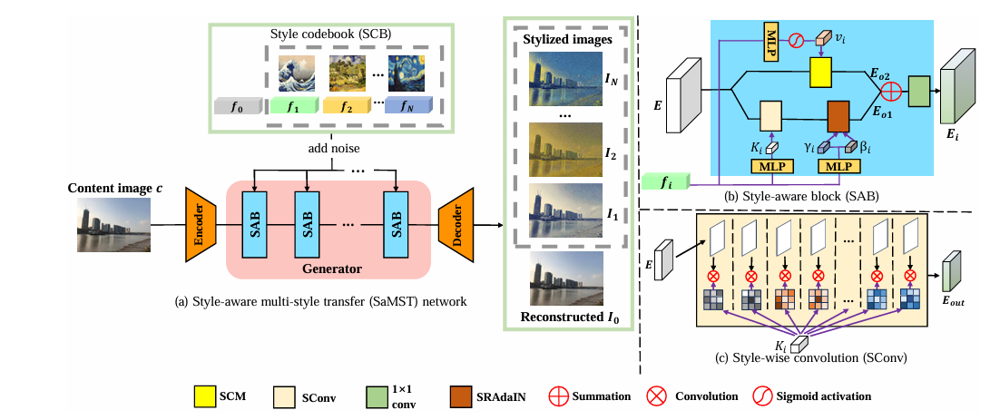

# Pluggable Style Representation Learning for Multi-Style Transfer (ACCV 2024)

Pytorch implementation of paper *Pluggable Style Representation Learning for Multi-Style Transfer* (ACCV 2024 paper).



Visual examples:


## Installation

- Install python 3.8.0, torch 2.0.0, CUDA 11.7 and other essential packages (Note that using other versions of packages may affect performance).
- Clone this repo

```
git clone https://github.com/Chernobyllight/SaMST
cd SaMST
```


## Test

- Get into evaluation codes folder './test_model/test1/test.yml'

  ```
  cd ./test_model/test/
  ```

- We provide pretrained models trained on 10 styles in './checkpoints/'. Before testing, specify the model checkpoint in 'test.yml'.

  ```
  model: './checkpoints/epoch_20.model'
  ```

   Or change the path with your own absolute path. Then you need to specify the number of styles to train the whole model. 

  ```
  style_num: 10
  ```

  Finally, specify your own test content image folder:

  ```
  content_image_dir: './content/'
  ```

- Run 'test.py'

  ```
  python test.py
  ```

## Train

We provide two training pipelines. If you have a large number of styles, please get into ***train1***. In contrast, if you just train the model on several styles, you can get into ***train2*** to strike a fast convergence. There is no difference on the two training pipelines' option setting. Here is a example of pipeline ***train1***.

- Get into training codes folder './train_model/train1/train.yml':

  ```
  cd ./train_model/train1/train.yml
  ```

- Specify the dataset paths in 'train.yml':

  ```
  dataset: your_training_content_path
  style_image: your_training_style_path
  ```

  Or change the path with your own dataset absolute path. Then specify the checkpoint saving path:

  ```
  save_model_dir: './checkpoint/'
  ```

- Run 'train.py'

  ```
  python train.py
  ```

  